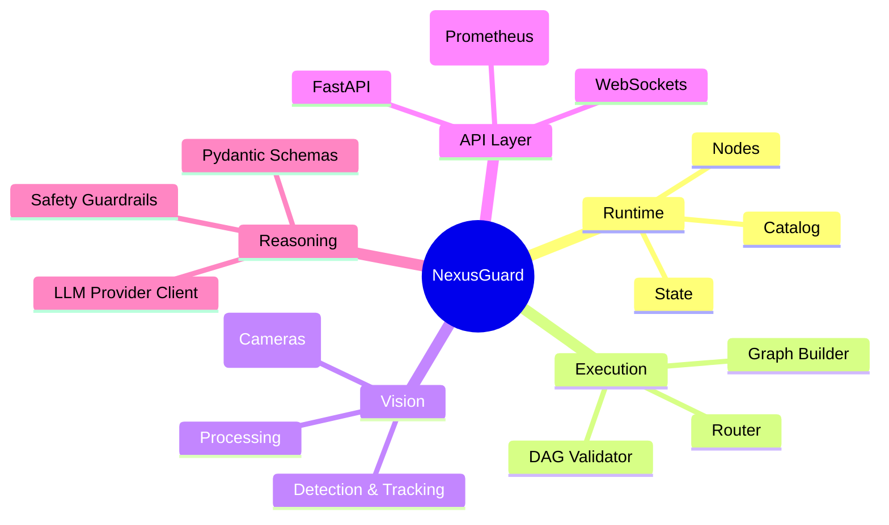

<div align="center">

# ⚡ NexusGuard

### Asynchronous Event-Driven Intelligent Vision Platform

**A real-time computer-vision platform driven by a directed acyclic graph (DAG) of nodes, featuring a pluggable agentic reasoning engine for scene understanding.**

*Turn any camera stream into risk-scored, human-readable, auditable incidents — through a robust pipeline of inspectable operations.*

<br/>

[](./LICENSE)
[](./pyproject.toml)
[](./api)
[](#-project-status)

</div>

---

## 📍 Table of Contents

- [What is NexusGuard?](#-what-is-nexusguard)
- [System Architecture](#-system-architecture)
- [The Pipeline (Ingest to Broadcast)](#-the-pipeline)
- [The Agentic Reasoning Engine](#-the-agentic-reasoning-engine)
- [Features](#-features)
- [Quickstart](#-quickstart)
- [Repository Layout](#-repository-layout)
- [Project Status](#-project-status)
- [License & Attribution](#-license--attribution)

---

## 🧭 What is NexusGuard?

NexusGuard is an **asynchronous, event-driven** computer vision framework. It processes live camera feeds through a validated directed acyclic graph (DAG) of interchangeable nodes: `Ingest → Process → Analyze → Verify → Synthesize → Broadcast`. 

Unlike traditional monolithic architectures that load enormous end-to-end models, NexusGuard orchestrates a pipeline of small, highly-specialized stages. The perception layer handles pixel-perfect object detection locally, while a dedicated, swappable Agentic Reasoning Engine provides high-level scene understanding and anomaly detection. 

NexusGuard outputs a bounded, evidence-carrying `Incident` at the end of every evaluation cycle.

---

## 🏗️ System Architecture

NexusGuard is partitioned into a layered architecture for maximum extensibility and testability:



The system is rigorously validated before execution. Every node connection is checked against strongly-typed input/output schemas. If a pipeline is misconfigured, it fails at initialization—never mid-stream during critical camera analysis.

---

## 🔁 Asynchronous Event-Driven Pipeline

NexusGuard features a production-grade asynchronous, event-driven execution runtime built using Python's `asyncio` framework. Component stages communicate purely through bounded, telemetry-monitored queues:

```
                  ┌───────────────────────┐
                  │    Camera Manager     │
                  └───────────┬───────────┘
                              │ Ingest (Multi-Camera)
                              ▼
                  ┌───────────────────────┐
                  │      Frame Queue      │
                  └───────────┬───────────┘
                              │ FrameContext
                              ▼
                  ┌───────────────────────┐
                  │   Detection Workers   │  (Worker Pool)
                  └───────────┬───────────┘
                              │
                              ▼
                  ┌───────────────────────┐
                  │   Tracking Workers    │  (Worker Pool)
                  └───────────┬───────────┘
                              │
                              ▼
                  ┌───────────────────────┐
                  │   Reasoning Workers   │  (Worker Pool)
                  └───────────┬───────────┘
                              │
                              ▼
                  ┌───────────────────────┐
                  │    Storage Workers    │  (Worker Pool)
                  └───────────┬───────────┘
                              │
                              ▼
                  ┌───────────────────────┐
                  │  Websocket/Dashboard  │
                  └───────────────────────┘
```

### Key Architectural Pillars

- **Asynchronous Execution & Worker Pools**: Each pipeline stage is decoupled into a configurable `WorkerPool` (e.g. `DetectorPool`, `TrackingPool`). Workers execute concurrently, pulling payloads off their incoming queue, processing them, and placing results into the downstream queue. This prevents any slow stage (like Reasoning) from blocking frame ingest.
- **Intelligent Backpressure & Bounded Memory**: The system features bounded queues implementing strict drop policies (`oldest`, `newest`, `block`). If downstream processors cannot keep up with camera FPS, older/newest frames are automatically dropped to prevent unlimited RAM usage.
- **Multi-Camera Scalability**: The `CameraManager` manages multiple webcam, RTSP, video, or mock streams independently. Registration is fully dynamic, and connections auto-recover upon failures.
- **Performance Profiling**: Active telemetry measures processed FPS, active tracks, queue wait times, and end-to-end latency metrics (p95 percentiles) per frame using a unified `FrameContext`.

---

## 🧠 The Agentic Reasoning Engine

The core innovation in NexusGuard is its separation of *fast perception* and *slow deliberation*. 

NexusGuard employs a swappable `PluggableLlmProvider` to synthesize validated tracking data into actionable insights. Through structured prompt templates and Pydantic schema validation, the agentic layer assigns a unified risk score (0.0 to 1.0) and generates human-readable incident summaries. 

The reasoning engine implements memory, Tenacity-based retry logic, and fallback heuristic adjudication if the LLM backend is unavailable, ensuring high availability in edge deployments.

---

## 🚀 Features

NexusGuard includes several production-grade ML infrastructure features:

- **Asynchronous Pipeline Execution**: Non-blocking I/O operations for frame capture and database persistence.
- **Configurable Workflows**: Declarative YAML-based graph routing.
- **Event Bus & Storage**: SQLite-backed incident persistence.
- **Telemetry**: Prometheus metrics endpoint (`/metrics`) and structured JSON logging.
- **Pluggable Architecture**: Easily swap in new tracking algorithms or detection models.
- **Live Dashboard**: Web UI with live WebSocket stream, timeline filters, and latency/FPS telemetry.
- **Safety Guardrails**: Prompt injection defense and bounded output clamping.

---

## 🛠️ Quickstart

```bash
# 1. Configure your environment
cp .env.example .env

# 2. Run with Docker Compose
docker compose up -d

# 3. Validate your node graph locally
python scripts/graph_validator.py

# 4. Open the interactive dashboard
open http://localhost:5173
```

---

## 🧩 Pluggable CV Workflow Framework

NexusGuard operates as a dynamic, extensible Computer Vision workflow engine. Users can write custom Python nodes and hook them directly into the DAG using YAML configuration declarations.

### Node Lifecycle

Each component in the graph inherits from `BaseNode` and exposes standard lifecycle methods:
1. `initialize()`: Loaded on startup (e.g. download weights or allocate memory).
2. `execute(inputs, context)`: Processes incoming data streams within an `ExecutionContext`.
3. `shutdown()`: Released on exit.

### Dynamic Plugins

Drop custom python files in the `plugins/` directory (under subfolders like `detectors/`, `trackers/`, `reasoners/`, `alerts/`, `storage/`, `analytics/`). The framework discovers and validates them at runtime using the `PluginRegistry` without restarting services.

### Framework CLI

The CLI tool allows checking, listing, and running workflows:

```bash
# List all registered plugins/extensions
python cli.py list-plugins

# List configured workflows
python cli.py list-workflows

# Validate a workflow YAML file for structural errors, cycles, or isolated nodes
python cli.py validate-workflow config/example_plugin_workflow.yaml

# Run a single-pass execution of a workflow
python cli.py run-workflow config/example_plugin_workflow.yaml
```

---

## 📂 Repository Layout

```text
nexusguard/
├─ runtime/     # Core node abstraction, DAG validation, and router
├─ vision/      # Computer vision nodes: ingest, process, analyze, verify
├─ reasoning/   # Agentic reasoning engine, memory, adjudicator, safety
├─ api/         # FastAPI, WebSockets, Prometheus metrics, SQLite models
├─ ui/          # Dashboard frontend, live WebSocket streaming, timeline
├─ config/      # Declarative YAML workflow and system settings
├─ scripts/     # Utility scripts (e.g. graph_validator.py)
├─ tests/       # Pytest unit tests for all components
└─ README.md
```

---

## 📊 Project Status

NexusGuard is actively maintained as an ML Systems reference architecture. It demonstrates patterns for building reliable, observable, and modular AI infrastructure. 

---

## 📜 License & Attribution

NexusGuard is licensed under the **[Apache-2.0](./LICENSE)** license. 

*Attribution: This project was originally inspired by the architectural concepts found in roboflow/inference, pysource-com/VisoNode, SharpAI/DeepCamera, and GetStream/Vision-Agents. It has been extensively reimagined and independently implemented to serve as a robust ML infrastructure reference project.*
